# ShaderDev

Study log on Chayan Vinayak Goswami's ShaderDev

## 00

- <https://shaderdev.com/>
- Chayan Vinayak Goswami
- TA 8 years

## 01. What is Shader

``` ref
쉐이더란 화면에 출력할 픽셀의 위치와 색상을 계산하는 함수
쉐이더(shader)란 '색의 농담, 색조, 명암 효과를 주다.'라는 뜻을 가진 shade란 동사와 행동의 주체를 나타내는 접미사 '-er'을 혼합한 단어입니다.
즉, 색의 농담, 색조, 명암 등의 효과를 주는 주체가 쉐이더란 뜻

- https://kblog.popekim.com/2011/11/01-part-1.html
```

|     | 코어갯수 | 연산                 |
| --- | ---- | ------------------ |
| CPU | 몇개   | serial operation   |
| GPU | 수천개  | parallel operation |

``` ref
강력한 마이크로 프로세서를 몇개 또는 큰 파이프를 쓰는 대신,
매우 작은 마이크로 프로세서들을 한번에 돌리는 것이다. 그것이 바로 GPU(Graphic Processor Unit).

- https://thebookofshaders.com/01/?lan=kr
```

| 쉐이더                 | 기능                                |
| ------------------- | --------------------------------- |
| Vertex              |                                   |
| Geometry            | input primitive                   |
| Fragment / Pixel    |                                   |
| Compute             | 렌더링 파이프라인에 속해 있지 않음. GPU 병렬 처리 목적 |
| Tessellation / Hull | OpenGL 4, DirectX3D 11, Metal     |

## 02. Working of a Shader

### 파이프라인

- ref: <https://vulkan-tutorial.com/Drawing_a_triangle/Graphics_pipeline_basics/Introduction>


### Vertex Shader Input/Output

- Vertex Shader Input
  - Position(Local/Object Space)
  - Normal
  - Color
  - ...
- Vertex Shader Output
  - Position(Clip Space)
  - other infos

### Rasterize

1. geometry에 어떤 Sample들이 화면에 그려지는지 결정하고(sampling)
2. Vertex-Output을 이용하여 데이터(Fragment)들을 interpolate하여 Fragment Shader로 넘김.

### Fragment Shader

Fragment를 이용하여, 각 픽셀의 값(색)을 구한다.

## 03. Components of a Shader

``` shader
Shader "ShaderName"
{
  Properties
  {
  }

  Sub-Shader
  {
    Tags
    {
    }

    Pass
    {
      hardware features(support graphics api(metal / gles / xbox360))
      [#pragma onlyrenderer metal]
      occlusion pass
      lighting pass
      beauty(diffuse, color) pass

      Vertext-Shader-Input
      Fragment-Shader-Input

      Vertex-Shader
      Fragment-Shader
    }
  }
  Fallback
}

```

## 04. Bare-bones shader

- <https://docs.unity3d.com/Packages/com.unity.render-pipelines.universal@10.3/manual/writing-shaders-urp-basic-unlit-structure.html>

``` hlsl
Shader "ShaderDevURP/BareBone"
{
    Properties
    {
        _Color("Main Color", Color) = (1, 1, 1, 1)
    }

        SubShader
    {
        Tags
        {
            "RenderType" = "Opaque"
            "RenderPipeline" = "UniversalPipeline"
        }

        Pass
        {
            HLSLPROGRAM
            #pragma vertex vert
            #pragma fragment frag

            #include "Packages/com.unity.render-pipelines.universal/ShaderLibrary/Core.hlsl"

            CBUFFER_START(UnityPerMaterial)
                half4 _Color;
            CBUFFER_END

            struct Attributes
            {
                float4 positionOS   : POSITION;
            };

            struct Varyings
            {
                float4 positionHCS  : SV_POSITION;
            };

            Varyings vert(Attributes IN)
            {
                Varyings OUT = (Varyings)0;
                OUT.positionHCS = TransformObjectToHClip(IN.positionOS.xyz);
                return OUT;
            }

            half4 frag() : SV_Target
            {
                return _Color;
            }
            ENDHLSL
        }
    }
}
```

## 05. Model-View-Projection Matrix


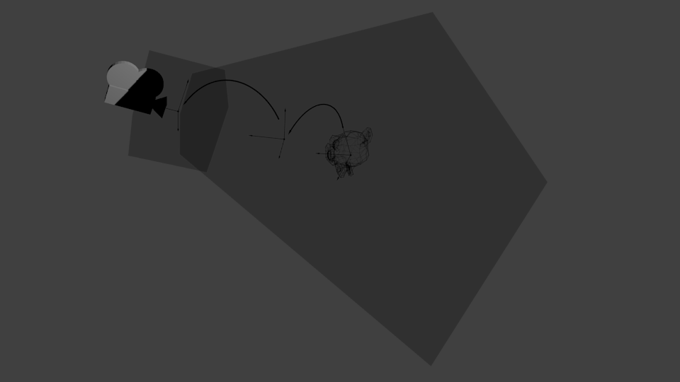


|                   |      |                          |
| ----------------- | ---- | ------------------------ |
| Coordinate System | 좌표계  | 좌표를 이용하여, 특정 요소의 위치를 정의. |
| Coordinate Space  | 좌표공간 | 한점의 위치가 다른 점과의 관계로 규정.   |

- Vector4 이유

    | (x, y, z, w) |           |                   |
    | ------------ | --------- | ----------------- |
    | w == 1       | (x,y,z,1) | position in space |
    | w == 0       | (x,y,z,0) | direction         |

- Matrix 4x4 이유

    ``` ref
    선형변환으로 확대/축소, 회전, 찌그러뜨리기(skewing)의 조합을 표현할 수 있다고 배웠죠.
    선형변환만으로는 평행이동을 만들어낼 수 없다는 것이 문제입니다
    ...
    선형변환에 상수항이 첨가된 변환을 affine 변환이라고
    ...

    - https://gpgstudy.com/forum/viewtopic.php?t=25011
    ```

- 예) 이동 매트릭스 x 방향벡터

    

- 예) 이동 매트릭스 x 위치백터

    

## 06. Depth Sorting / Z-Sorting

- Z-Sorting -> Render Queue -> Painter's algorithm(카메라와 거리 기반)

- Render Queue

    ``` ref
    Tags { "Queue" = "Geometry-1" }
    ```

| min  | default | max  |             |
| ---- | ------- | ---- | ----------- |
| 0    | 100     | 1499 | Background  |
| 1500 | 2000    | 2399 | Geometry    |
| 2400 | 2450    | 2699 | AlphaTest   |
| 2700 | 3000    | 3599 | Transparent |
| 3600 | 4000    | 5000 | Overlay     |

|      |                |       |
| ---- | -------------- | ----- |
| 0    | Rendered First | Back  |
| 5000 | Rendered Last  | Front |

## 07. Sub Shader Tags

- Tags는 `,`로 구분하지 않는다.(공백으로 구분.)

    ``` shader
    Tags { ___ = ___   ___ = ___ }
    ```

### TODO: IgnoreProjector

"IgnoreProjector" = "True"
"IgnoreProjector" = "False"

### RenderType

- 쉐이더 변경시 쓰이는 키 지정.
- <https://docs.unity3d.com/Manual/SL-ShaderReplacement.html>
- [Camera.RenderWithShader](https://docs.unity3d.com/ScriptReference/Camera.RenderWithShader.html)
- [Camera.SetReplacementShader](https://docs.unity3d.com/ScriptReference/Camera.SetReplacementShader.html)
- 일반적으로 RenderType는 Queue의 이름과 동일하게 설정

    ``` hlsl
    "Queue" = "Transparent"
    "RenderType" = "Transparent"
    ```

    ``` csharp
    // Opaque를 "X-rayShader"로 바꾸어라.
    Camera.main.SetReplacement("X-rayShader", "Opaque")
    ```

## 08. Blending

``` ref
Blend(srcFactor, blendOp, dstFactor)

srcFactor: 작업 대상 [0 ~ 1]
dstFactor: 컬러버퍼에 있는 값들 [0 ~ 1]
blendOp: Add(default), Sub, RevSub, Min, Max ...

Merged Pixel = blendOp((srcColor * srcFactor), (dstColor * dstFactor))
```

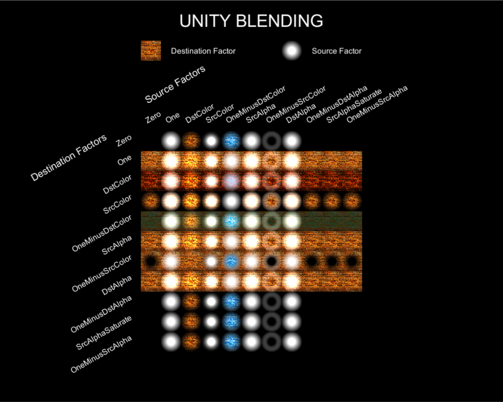


## 09. Texture Mapping

``` hlsl
// Texture 속성
// Wrap Mode - Clamp / Repeat

Properties
{
    _MainTex("Main Texture", "2D") = "white" {}
}

uniform sampler2D _MainTex;
uniform float4 _MainTex_ST;

float4 texcoord : TEXCOORD0;

_MainTex_ST.xy; // Tiling
_MainTex_ST.zw; // Offset

float4 color = tex2D(_MainTex, texcoord);


// UnityCG.cginc
// Transforms 2D UV by scale/bias property
#define TRANSFORM_TEX(tex,name) (tex.xy * name##_ST.xy + name##_ST.zw)

out.texcoord.xy = in.texcoord.xy * _MainTex_ST.xy + _MainTex_ST.zw;
out.texcoord.xy = TRANSFORM_TEX(in.texcoord, _MainTex);
```

``` hlsl
Blend SrcAlpha OneMinusSrcAlpha

TEXTURE2D(_MainTex); SAMPLER(sampler_MainTex);
            
CBUFFER_START(UnityPerMaterial)
    float4 _MainTex_ST;
CBUFFER_END

struct Attributes
{
    float4 uv           : TEXCOORD0;
};

struct Varyings
{
    float4 uv           : TEXCOORD0;
};

Varyings vert(Attributes IN)
{
    OUT.uv = TRANSFORM_TEX(IN.uv, _MainTex);
}

half4 frag() : SV_Target
{
    float4 tex = SAMPLE_TEXTURE2D(_MainTex, sampler_MainTex, IN.uv);
}

// com.unity.render-pipelines.core/ShaderLibrary/API/D3D11.hlsl
#define TEXTURE2D(textureName)                Texture2D textureName
#define SAMPLER(samplerName)                  SamplerState samplerName
#define SAMPLE_TEXTURE2D(textureName, samplerName, coord2)                               textureName.Sample(samplerName, coord2)

// com.unity.render-pipelines.core/ShaderLibrary/Macros.hlsl
#define TRANSFORM_TEX(tex, name) ((tex.xy) * name##_ST.xy + name##_ST.zw)
```

## 10. Gradient Pattern

``` ref
Direct X

    UV 좌표계가 텍스처 메모리 레이아웃과 일치한다는 장점
    따라서 UV좌표를 기반으로 텍스처 조작(texture manipulation)을 하면 매우 직관적이고 쉬움
    - https://blog.popekim.com/ko/2012/06/11/unity-i-love-you-but-your-uv-is-horrible.html

(0,0)        (1,0)
  +-----+-----+
  |     |     |
  |     |     |
  +-----+-----+
  |     |     |
  |     |     |
  +-----+-----+
(0,1)        (1,1)


OpenGL / UnityEngine

(0,1)        (1,1)
  +-----+-----+
  |     |     |
  |     |     |
  +-----+-----+
  |     |     |
  |     |     |
  +-----+-----+
(0,0)        (1,0)
```

Quad, Plane의 UV맵핑이 다르다. Quad는 좌하단. Plane은 우하단

### 그래프생성 유틸

- Mac: [Grapher](https://www.goldensoftware.com/products/grapher)
- Online: <https://www.desmos.com/calculator>

## 11. Wave Functions

- sqrt / sin / cos / tan 그래프

## 12. Line Pattern

``` hlsl
half DrawLine(half2 uv, half start, half end)
{
    if (start < uv.x && uv.x < end)
    {
        return 1;
    }
    return 0;
}
```

## 13. Union and Intersection

## 14. Circle Pattern

``` hlsl
half DrawCircle(half2 uv, half2 cp, half r)
{
    // cp : center position
    // r  : radius

    half x2y2 = pow((uv.x - cp.x), 2) + pow((uv.y - cp.y), 2);
    half r2 = pow(r, 2);
    if (x2y2 > r2)
    {
        return 0;
    }
    return 1;
}
```

## 15. Smoothstep

- [smoonthstep](https://developer.download.nvidia.com/cg/smoothstep.html)
- <https://thebookofshaders.com/glossary/?search=smoothstep>

``` hlsl
float smoothstep(float a, float b, float x)
{
    float t = saturate((x - a)/(b - a));
    return t * t * (3.0 - (2.0 * t));
}
```

``` ref
smoothstep(1, 0.5, uv.x);

+----------+----------+----------+----------+
1(from)    0.75       0.5(to)    0.25       0
```

| from | to  |            |        |
| ---- | --- | ---------- | ------ |
| 1    | 0.5 | texcoord.x | return |
| 1    | 0.5 | 0          | 1      |
| 1    | 0.5 | 0.25       | 1      |
| 1    | 0.5 | 0.5        | 1      |
| 1    | 0.5 | 0.75       | 0.5    |
| 1    | 0.5 | 1          | 0      |

## 16. Circle Fading Edges

``` hlsl
float drawCircleFade(float2 uv, float2 cp, float r, float feather)
{
    float x2y2 = pow((uv.x - cp.x), 2) + pow((uv.y - cp.y), 2);
    float r2 = pow(r, 2);
    if (x2y2 > r2)
    {
        return 0;
    }
    return smoothstep(r2, r2 - feather, x2y2);
}
```

## 17. Pattern Animation

sin / cos 함수와 _Time변수를 이용한 에니에미션.

| Name            | Type   | Value                                                                                      |
| --------------- | ------ | ------------------------------------------------------------------------------------------ |
| _Time           | float4 | Time since level load `(t/20, t, t * 2, t * 3)`, use to animate things inside the shaders. |
| _SinTime        | float4 | Sine of time: (t/8, t/4, t/2, t).                                                          |
| _CosTime        | float4 | Cosine of time: (t/8, t/4, t/2, t).                                                        |
| unity_DeltaTime | float4 | Delta time: (dt, 1/dt, smoothDt, 1/smoothDt).                                              |

## 18. Vertex Animation

- 깃발의 vertex position을 sin으로 흔들고 중심점 위치 보정.

``` hlsl
half4 VertexFlagAnim(half4 p, half2 uv)
{
    p.z += sin((uv.x - (_Time.y * _Speed)) * _Frequency)
    p.z *= (uv.x *_Amplitude);
    return p;
}
```

## 19. Normals

- vertex normal
- face normal

구하고자 하는 vertex를 포함하고 있는 face normal을 모두 구하고 normalize를 하면 vertex normal을 얻을 수 있다.

## 20. Normal-Vertex Animation

``` shader
float4 vertexAnimNormal(float4 p, float4 normal)
{
    p.z += sin((normal - (_Time.y * _Speed)) * _Frequency) * (normal *_Amplitude);
    return p;
}
```

## 21. Rendering Pipeline - part 1

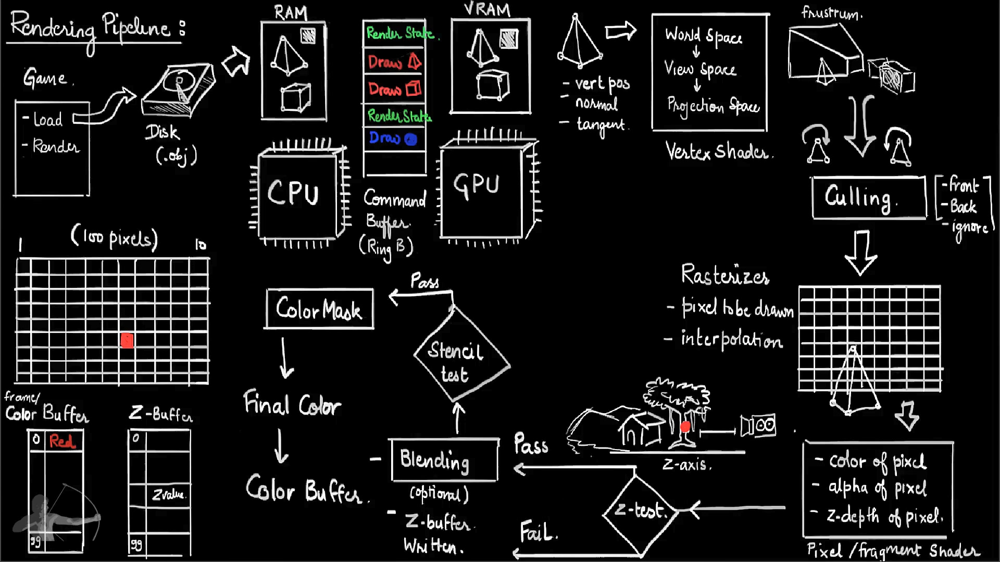

### RenderState

- Material
- Vertex shader
- Pixel shader
- texture
- Lighting setting

### Batch

RenderState의 변화.

예)

``` ref
[RenderStateX [Draw A] [Draw B] [Draw C]]

DrawCall          : 3번 (A, B, C)
RenderState       : RenderStateX
Batches           : 1번 (A, B, C가 동일한 RenderState)
Saved by batching : 2.  (A다음에 오는 B, C를 그릴 동안 RenderState변화가 없음.)
```

### Fragment Shader 이후

``` ref
ZTest
  -> Pass <Z-Buffer>
  -> 블랜딩
  -> [선택적]스텐실 테스트
  -> Pass
  -> [선택적] Color Mask
  -> Final Color
  -> <Color Buffer>
```

## 22. Rendering Pipeline - part 2

- <https://docs.unity3d.com/Manual/SL-CullAndDepth.html>
- [5강 알파와알파소팅](https://www.slideshare.net/jpcorp/5-10351002)

|        |                                       |                                                                                                    |
| ------ | ------------------------------------- | -------------------------------------------------------------------------------------------------- |
| ZWrite | [On]/Off                              | Z-Buffer 값을 작성할지 안할지. Off시 Z-Buffer 변경안함. On시 ZTest통과시 Z-Buffer값을 현재 ZTest값으로 설정(불투명 오브젝트에서 많이 쓰임) |
| Cull   | [Back] / Front / Off                  | 해당 면을 렌더링 하지 않음                                                                                    |
| ZTest  | [(<=)LEqual]/Less/NotEqual/Always ... | if ( Z-Buffer `xop` Z-Depth ) { Zwrite }                                                           |

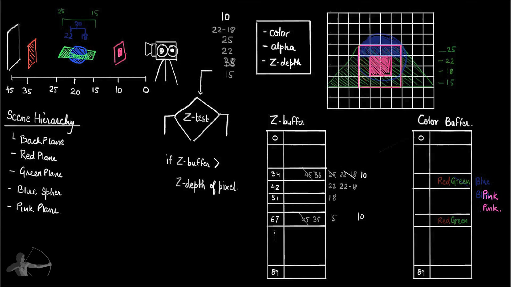

- [5강 알파와알파소팅](https://www.slideshare.net/jpcorp/5-10351002)

## 23. Normal Maps Types

- <http://wiki.polycount.com/wiki/Normal_Map_Technical_Details>

### Object-Space Normal Map

- forward/backward face기반(+z, -z).
- Normal의 xyz를 rgb로 Texture에 저장.
- 따라서 x, y, z가 0~1사이의 모든 방향으로 적절하게 분배되어 알록달록하게 보임.

### Tangent-Space Normal Map

- forward face기반.
- Tangent Vector는 Normal Vector와 수직인 벡터이다(여러개...). 따라서 통상적으로 UV 좌표와 비교하여
  - Tangent Vector: U 좌표와 일치하는 Vector
  - BiTangent Vector: V 좌표와 일치하는 Vector

TBN-matrix

``` ref
TBN = | Tx Ty Tz | // Tangent  | U
      | Bx By Bz | // Binormal | V
      | Nx Ny Nz | // Normal
```

| Software | Red | Green | Blue |
| -------- | --- | ----- | ---- |
| `Unity`  | X+  | Y+    | Z+   |
| Maya     | X+  | Y+    | Z+   |
| Blender  | X+  | Y+    | Z+   |
| `Unreal` | X+  | Y-    | Z+   |
| 3ds Max  | X+  | Y-    | Z+   |

- Right handedness, which coincides with OpenGL is indicated with a plus sign (ex. +Y)
- Left handedness, which coincides with DirectX, is indicated with a negative sign (ex. -Y)

## 24. Points and Vectors

## 25. Vector Multiplication

- 내적과 외적 공식.
- 내적과 외적을 시각적으로 생각할 수 있어야 함.
- 이거 이름 햇갈리기 쉬움.

### | Dot Product   | Inner Product | 내적 |

- 닷은 점이니까 모이는건 내적
- 점이니까 두개 모아서 하나가 됨.
- 하나로 모이니 두 벡터 사이의 각도를 구할 수 있음.
- 각도니까 cos연산 들어감.
- <https://rfriend.tistory.com/145>
- 교환법칙이 성립

``` ref
| 각도   | 값   |
| ---- | --- |
| 0    | 1   |
| 90   | 0   |
| 180  | -1  |
| -270 | 0   |

        1
        |
        |
0-------+------ 0
        |
        |
       -1
```

### | Cross Product | Outer Product | 외적 |

- 크로스는 삐죽하니까 외적으로 외울껏.
- X 니까 삐저나옴.
- X가 직각이니 수직 구할때 씀.
- <https://rfriend.tistory.com/146>
- 교환법칙 성립안함

## 26. Normal Map Shader - intro

TBN : (Tangent Binormal Normal)

### obj TBN 기반으로 world_N 구하기

``` shader
VS
    obj_TBN = float3(Input.T, cross(Input.N, Input.T), Input.N); // object to tangent TBN

PS
      obj_N = mul(inverse(obj_TBN), tangent_N);
            = mul(transpose(obj_TBN), tangent_N);
            = mul(tangent_N,  obj_TBN);
    world_N = mul(obj_N, unity_World2Object);
```

### world TBN 기반으로 world_N 구하기

world TBN기반으로 world Normal을 얻기위해 PS에서 한번만 곱하면 된다.

``` shader
VS
      world_T =    mul(unity_Object2World, Input.T);            // 표면에 붙어있으므로 shifting과 무관
      world_N =    mul(Input.N           , unity_World2Object); // shifting 방지.
      world_B =  cross(world_N, world_T);
    world_TBN = float3(world_T, world_B, world_N); // world to tangent TBN.

PS
    world_N = mul(tangent_N, world_TBN);
```

### normal shiting

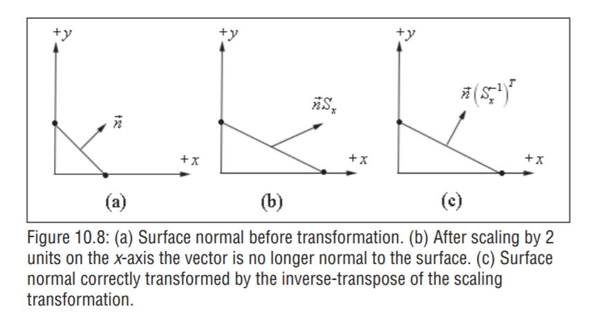

``` ref
     M == unity_Object2World;
M_want == transpose( inverse(unity_Object2World) )
       == transpose( unity_World2Object )

mul(matrix, vector) == mul(vector, transpose(matrix))

mul(M_want, v) == mul( transpose( unity_World2Object ), V )
               == mul(                               V, unity_World2Object )
```


### from tangent_N to world_N

- 유니티의 rgb 입력 범위는 [0 ~ 1]
- 유니티의 노멀의 범위는 [-1 ~ 1]
- n따라서 rgb에서 노멀의 구할려면 범위를 2배로 늘리고, -1만큼 이동시켜줘야함.
- (color channel * 2) - 1

``` shader
PS
    tangent_N = tex2D(_N_Texture, Input.mUV).rgb;
    tangent_N = (tangent_N * 2) - 1;
      world_N = mul(tangent_N, world_TBN);
```

## 27. DXT-Compression

- [S3 Texture Compression](https://en.wikipedia.org/wiki/S3_Texture_Compression)
- [DXT Compression](https://www.fsdeveloper.com/wiki/index.php?title=DXT_compression_explained)
- 4x4 픽셀 중에, 색 2개를 고름. 2개의 색을 interpolation시켜서 4x4 color 인덱스를 만듬.
- 손실압축.

### DXT1 포맷을 이용

| V   | color | channel | bit |
| --- | ----- | ------- | --- |
| X   | R     | color0  | 16  |
| Y   | G     | color1  | 16  |
| Z   | B     | x       | 0   |

``` ref
XYZ가 normalize 되었다면, X와 Y만 알아도 Z를 구할 수 있다.

1 = (X * X) + (Y * Y) + (Z * Z)
Z = sqrt(1 - ((X * X) + (Y * Y)))
```

## 28. Normal Map Shader - part 1

## 29. Normal Map Shader - part 2

``` shader
    uniform sampler2D _MainTex;
    uniform float4 _MainTex_ST;

PS
    Output.T = normalize(mul(Input.T, unity_ObjectToWorld));
    Output.N = normalize(mul(Input.N, unity_WorldToObject));
    Output.B = normalize(cross(Output.N, Output.T) * Input.T.w);

VS
    // 일반 탄젠트맵 버전.
    float3 colorT = tex2D(_Tangent_Map, Input.mUV).rgb;
    float3 tangent_N = colorT * 2 - 1;

    // DXT5nm 버전.
    float3 colorT = tex2D(_Tangent_Map_DXT5nm, Input.mUV).rgb;
    float3 tangent_N   = float(colorT.a * 2 - 1, colorT.g * 2 - 1, 0);
           tangent_N.z = sqrt(1 - dot(tangent_N.xy, tangent_N.xy));

    float3x3 world_TBN = float3x3(Input.T, Input.B, Input.N); // world to tangent TBN
    float3   world_N   = mul(inverse(world_TBN), tangent_N);
                       = mul(transpose(world_TBN), tangent_N);
                       = mul(tangent_N, world_TBN);
```

[Input.T.w를 곱하는 이유](https://forum.unity.com/threads/what-is-tangent-w-how-to-know-whether-its-1-or-1-tangent-w-vs-unity_worldtransformparams-w.468395/)

- `UV`, `ST` 도대체 뭐야.
  - 3d 좌표계에서 xyzw 취함. uv남음. st남음.
  - uv - 텍스처 좌표계
  - st - 텍셀(texel = Texture + pixel) 좌표계

``` ref
UV - texture's coordinate
       +-------+ (1, 1)
       |       |
       |       |
(0, 0) +-------+

ST - surface's coordinate space.
       +-------+ (32, 32)
       |       |
       |       |
(0, 0) +-------+

    o.texcoord.xy = (v.texcoord.xy * _MainTex_ST.xy + _MainTex_ST.zw)

| xy  | tiling |
| zw  | offset |
```

## 30. Outline Shader - intro

### 행렬

#### 단위 행렬

``` ref
| 1 0 0 0 |
| 0 1 0 0 |
| 0 0 1 0 |
| 0 0 0 1 |
```

#### 이동(translate) 행렬

``` ref
| 1 0 0 x |
| 0 1 0 y |
| 0 0 1 z |
| 0 0 0 1 |
```

#### 스케일(scale) 행렬

``` ref
| x 0 0 0 |
| 0 y 0 0 |
| 0 0 z 0 |
| 0 0 0 1 |
```

#### 회전 행렬

2차원 회전

``` ref
| x' | = | cos$ -sin$||x|
| y' |   | sin$  cos$||y|
```

3차원 회전

- 회전행렬 기준으로 생각한다.
- 2차원 회전 행렬을 기억한다.
- 기준 행 아래가 `-sin$`이다.

``` ref
X

| 1(x)  0    0     0    | (x 아레 -sin$)
| 0     cos$ -sin$ 0    |
| 0     sin$  cos$ 0    |
| 0     0    0     1    |

Y

| cos$  0    sin$  0    |
| 0     1(y) 0     0    | (y 아레 -sin$)
| -sin$ 0    cos$  0    |
| 0     0    0     1    |

Z

| cos$  -sin$ 0    0    |
| sin$   cos$ 0    0    |
| 0     0     1(z) 0    | (z의 아래 마지막 열은 비워야하니 맨 위가 -sin$)
| 0     0     0    1    |
```

### 아웃라인 쉐이더 개괄

- Pass 1
  - 기준 모델 스케일 업.
  - outline 생상으로 칠하기
- Pass 2
  - 그 위에 덧 그리기

## 31. Outline Shader - code

- normal 사출방식.
  - 단점, 면들 사이의 갭들이 보임.
- 매트릭스를 통한 vertex 확대.

``` shader
Zwrite Off
Cull Front

float4 Outline(float4 vertexPosition, float w)
{
    float4x4 m;
    m[0][0] = 1.0 + w; m[0][1] = 0.0;     m[0][2] = 0.0;     m[0][3] = 0.0;
    m[1][0] = 0.0;     m[1][1] = 1.0 + w; m[1][2] = 0.0;     m[1][3] = 0.0;
    m[2][0] = 0.0;     m[2][1] = 0.0;     m[2][2] = 1.0 + w; m[2][3] = 0.0;
    m[3][0] = 0.0;     m[3][1] = 0.0;     m[3][2] = 0.0;     m[3][3] = 1.0;
    return mul(m, vertexPosition);
}
```

## 32. Author_s Check-in

## 33. Multi Variant Shader and Cginc files

``` shader
[KeywordEnum(On, Off)] _UseNormal("_UserNormalMap, float) = 0

[Enum(On 1, Off)]

[Toggle]
```

``` shader
[KeywordEnum(On, Off)] _UseNormal("_UserNormalMap, float) = 0
;; => _USE_NORMAL_ON // _USE_NORMAL_OFF

#pragma multi_compile _USE_NORMAL_ON
#pragma shader_feature _USE_NORMAL_ON

#if _USE_NORMAL_ON
#endif
```

- 여러 multi_compile 줄 결합
  - 여러 multi_compile 줄이 제공될 수 있고, 결과 셰이더가 가능한 모든 줄 조합에 대해 컴파일됩니다.

    ``` shader
    #pragma multi_compile A B C
    #pragma multi_compile D E
    ```

  - 첫 번째 줄에서 세 가지 배리언트가 생성되고, 두 번째 줄에서 두 가지 배리언트가 생성되어 총 여섯 가지의 셰이더 배리언트(A+D, B+D, C+D, A+E, B+E, C+E)가 생성됩니다

- Difference between shader_feature and multi_compile

    ``` shader
    shader_feature is very similar to multi_compile.
    The only difference is that Unity does not include unused variants of shader_feature shaders in the final build.
    For this reason, you should use shader_feature for keywords that are set from the Materials, while multi_compile is better for keywords that are set from code globally.
    ```

## 34. Multi Variant Shader - part 1

``` shader
[KeywordEnum(On, Off)] _UseNormal("_UserNormalMap, float) = 0

#pragma shader_feature _USE_NORMAL_ON

#if _USE_NORMAL_ON
#else
#endif
```

## 35. Multi Variant Shader - part 2

``` shader
float3 normalFromColor (float4 colorVal)
{
    #if defined(UNITY_NO_DXT5nm)
        return colorVal.xyz * 2 - 1;
    #else
        // R => x => A
        // G => y
        // B => z => ignored

        float3 normalVal;
        normalVal = float3 (
            colorVal.a * 2.0 - 1.0,
            colorVal.g * 2.0 - 1.0,
            0.0
        );
        normalVal.z = sqrt(1.0 - dot(normalVal, normalVal));
        return normalVal;
    #endif
}

float3 WorldNormalFromNormalMap(sampler2D normalMap, float2 normalTexCoord, float3 tangentWorld, float3 binormalWorld, float3 normalWorld)
{
    // Color at Pixel which we read from Tangent space normal map
    float4 colorAtPixel = tex2D(normalMap, normalTexCoord);

    // Normal value converted from Color value
    float3 normalAtPixel = normalFromColor(colorAtPixel);

    // Compose TBN matrix
    float3x3 TBNWorld = float3x3(tangentWorld, binormalWorld, normalWorld);
    return normalize(mul(normalAtPixel, TBNWorld));
}
```

## 36. Basic Lighting Model and Rendering Path - part 1

## 36. Basic Lighting Model and Rendering Path - part 2

### BEADS(구슬 목걸이)

- `B`asic Lighting Model

|            |      |                        |
| ---------- | ---- | ---------------------- |
| `A`mbient  | 주변광  | 전체적                    |
| `D`iffuse  | 난반사광 | 특정방향 입사, 고르게 반사        |
| `S`pecular | 전반사광 | 특정방향 입사, 특정방향으로 정확히 반사 |
| `E`misive  | 발산   | 발광체                    |

### Fowrad Rendering

- <https://docs.unity3d.com/Manual/RenderTech-ForwardRendering.html>
- 5 object x 4 lighting = 20 draw call
- 최적화 해서 라이트가 영향을 주는 오브젝트만 그림
- 어쨋든, 라이트가 늘어날 수록, 드로우 콜 수가 배로 늘어남.
- 모바일같은 척박한 환경에서는
  - 라이트를 하나만 유지
  - 라이트를 미리 텍스쳐에 구음.

#### Base Pass

``` shader
Tag { Queue = Transparency ...}
Pass {
    LightMode = "Forward Base"
}
```

- 1 per pixel `directional` light rendering
  - Spherical harmonic lights(Light probes, Global Illumination, Sky Ambient)

#### Additional Pass

``` shader
Pass {
    LightMode = "Forward Add"
}
```

- 1 per pixel additional light

``` ref
directional 라이트랑 point 라이트가 있으면,
directional light에는 forward base로
point light에는 forward add로 두가지 패스를 작성해야 한다.
```

### Legacy Deferred Lighting

- <https://docs.unity3d.com/Manual/RenderTech-DeferredLighting.html>

1. 씬을 `Geometry Buffer`에 렌더링한다.(보여지는 각 픽셀의 depth, normal, specular power)
2. Light Accumulation
    - 각 라이트에 영향을 받는 픽셀을 찾음.
    - 지오메트리 버퍼에서 데이터를 읽음
    - 라이트 값을 계산
    - `Light Accumulation buffer`에 저장.
3. 씬을 다시 렌더링 한다.
    - Accumulated light value + Mesh color + Ambient or Emissive light

### Deferred Shading

- <https://docs.unity3d.com/Manual/RenderTech-DeferredShading.html>

1. 씬을 `Geometry Buffer(g-buffer)`에 렌더링한다.
    - depth
    - diffuse color
    - normal(world space)
    - specular color
    - smoothness
    - emission
2. Light Accumulation
    - 각 라이트에 영향을 받는 픽셀을 찾음.
    - 지오메트리 버퍼에서 데이터를 읽음
    - 라이트 값을 계산
    - `Light Accumulation buffer`에 저장.
    - accumulated-light value와 diffuse color + spec + emission를 합친다.

- deferred shading vs deferred lighting
  - deferred shading에서는 씬을 다시 렌더링 하지 않아도 된다.(이미 지오메트리 버퍼에 저장했기때문에)
- Unity requirement for deferred shading
  - Graphic Card with multiple render target
  - Support Shader Model 3 or later
  - Support for Depth-Render Texture

## 38. Diffuse Reflection - intro

- 요한 하인리히 램버트 (Johann Heinrich Lambert)
- 램버트의 법칙을 만족하는 표면을 램버시안 (Lambertian)이라 함.
- 램버트 코사인 법칙(lambert's cosine law)
  - light in reflected off a surface based on cosine-fall off.
- Fowrad Rendering 기반으로
  - 씬에 하나 이상의 라이트가 있다면, 하나의 가장 밝은 directional light가 Base Pass에 사용.
  - 다른 라이트들은 Spherical Harmonics로 간주.

``` ref
벡터 L와 N의 사이각을 x라 했을때, 내적값은(내적은 교환법칙 성립)

dot(L, N) = |L| * |N| * cos(x)

L, N이 단위백터일때 |L|, |N|는 1.

cos(x) = dot(L, N)

따라서 lambert 값은

lambert = cos(x)
        = dot(L, N)
```

VS에서 lambert값을 구하면 보간값을 이용하기에, PS에서 lambert구한 것과의 차이가 있다.

## 39. Diffuse Reflection - code 1

## 40. Diffuse Reflection - code 2

## 41. Diffuse Reflection - code 3

## 42. Specular Reflection - intro

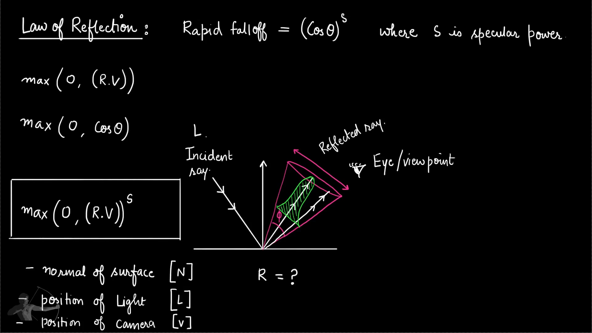

``` ref
입사벡터(incident)를 I라 했을때 reflect(I, N)은

R = reflect(I, N)
  = I - 2 * N * dot(I, N)
```

## 43. Specular Reflection - code 1

## 44. Specular Reflection - code 2

``` ref
N: Normal
L: Light
R: Reflect
V: Viewport
H: Halfway( normalize(L + V) )

L  N  R
 \ | /
  \|/
---+---
    \
     \
     -L

      Phong Reflection Model : max(0, dot(R, N))^S
Blinn-Phong Reflection Model : max(0, dot(H, N))^S
```

- 입사광의 각도/방향
- Normal
- 뷰포트/눈의 각도/방향

- tex2D, tex2Dlod
  - <https://docs.microsoft.com/en-us/windows/desktop/direct3dhlsl/dx-graphics-hlsl-tex2d>
  - <https://docs.microsoft.com/en-us/windows/desktop/direct3dhlsl/dx-graphics-hlsl-tex2dlod>
  - <https://docs.unity3d.com/Manual/SL-PlatformDifferences.html>
  - <https://docs.unity3d.com/Manual/SL-ShaderCompileTargets.html>

``` cg
// tex2D - pixel shader only
// float4 specularMap = tex2D(_SpecularMap, o.texcoord.xy);

// tex2Dlod - 2D texture lookup with specified level of detail and optional texel offset.
// samp : Sampler to lookup.
// s.xy : Coordinates to perform the lookup.
// s.w : Level of detail. (0 ~ n-1) (가장큰)첫번째 밉맵이 0

#pragma target 3.0
float4 specularMap = tex2Dlod(_SpecularMap, o.texcoord);
```

- pragma
  - <https://docs.unity3d.com/Manual/SL-ShaderCompileTargets.html>
  - `#pragma target 2.5 (default)`

## 45. Ambient Reflection - intro

주변(Ambient) 반사광.

``` ref
 A = ambient property of material * global ambient
   =                           KA * UNITY_LIGHTMODEL_AMBIENT
```

- <https://docs.unity3d.com/Manual/SL-UnityShaderVariables.html>

|                          |        |                                                                               |
| ------------------------ | ------ | ----------------------------------------------------------------------------- |
| unity_AmbientSky         | fixed4 | Sky ambient lighting color in gradient ambient lighting case.                 |
| unity_AmbientEquator     | fixed4 | Equator ambient lighting color in gradient ambient lighting case.             |
| unity_AmbientGround      | fixed4 | Ground ambient lighting color in gradient ambient lighting case.              |
| UNITY_LIGHTMODEL_AMBIENT | fixed4 | Ambient lighting color (sky color in gradient ambient case). Legacy variable. |

## 46. Ambient Reflection - code.mkv

## 47. Wrap up Basic Lighting Model

## 48. Advanced Lighting Model

기본 라이트 모델에는 뭔가 좀 부족하다.

- 그림자(Shadow)
- 오브젝트간 상호작용(Inter Object interaction)
- 에너지 균형(Energy Balance)
  - Energy balanced shading model

## 49. Hemispherical Lighting Model

- 오브젝트는 구의 센터에 빛의 방향이 구의 바깥에서 안쪽으로 비춘다 가정.
- Hemispherical(반구형) Lighting Model
  - 2 half sphere

|       |        |          |
| ----- | ------ | -------- |
| upper | sky    | N.L > 0  |
| lower | ground | N.L <= 0 |


## 50. Image Based Lighting

많은 라이트를 실시간으로 계산하기에는 무리

- light정보를 텍스쳐에 저장
  - Chrome ball
    - 눈에 가급적 많은 구역을 담을 수 있도록 카메라를 멀리 배치
    - 맵에 크롬볼(chrome ball)을 배치(눈에 보이는 방향으로부터 모든 라이트 정보를 저장)(이러한 크롬볼을 light probe라 한다) 
  - Fish eye lens
    - 185도까지 캡쳐 가능한 렌즈가 있음.
    - 2개로 묶어 360도를 캡쳐. 환경맵을 만듬.
- light probe로부터 환경맵(sphere, cube)을 제작
- 환경 맵으로부터 light계산

## 51. Irradiance Environment Map

- 복사조도 환경맵
- Irradiance : 무언가로부터 나오는 빛의 양을 나타내는 단위
- IBL(Image Based Rendering) : 환경맵이 수반되는 테크닉

``` ref
texCube - 어떤 텍셀이 노멀 방향과 만나게 되는가.

color = texCube(_Cube_Texture, NormalDirection);
```

### Light Environment Ma

- 빛의 정보(위치, 밝기등)을 텍셀에 저장

### 1. Light Map

오브젝트들의 이미지를 저장.

- 씬의 모든 미리 계산된 빛의 정보를 텍스쳐에 저장.
- 오브젝트의 N과 빛의 L에 기반하여, 미리 계산하여 저장하였기에 나중에 오브젝트가 회전하거나 변하게되면 미리 계산한 값과 맞지 않게된다.

### 2. Irradiance Environment Map

월드센터의 구의 N과 환경맵의 L에 대한 diffuse값(dot(N, L))을 저장.

- 환경맵(light)의 모든 텍셀이, 월드센터에 구가 있다고 가정.
- 구의 N과 텍셀의 L에 대해 dot(N, L)을 구하고.
- 그에 대한 색깔을 Irradiance Environment Map의 텍셀에 저장.

#### Irradiance Map만들기.

- Irradiance Map의 각 텍셀마다
  - 센터로부터 텍셀로의 방향(Normal값)을 구하고
  - Lighting Environment map의 각 텍셀마다
    - 미리 조명처리된 diffuse값을 가산하고
  - 계산된 diffuse 값을 Irradiance Map의 텍셀에 저장한다.

``` csharp
foreach (irr_texel in irradiance_map.texels)
{
    N = calculateDirectionFromCenter(irr_texel);
    diffuseColor = 0
    foreach (light_texel in lighting_environment_map.texels)
    {
        L = calculateDirectionFromCenter(light_texel)
        diffuseColor += Vector.Dot(N, L)
    }
    irr_texel.color = diffuseColor;
}
return irradiance_map
```

## 52. Image Based Reflection - intro

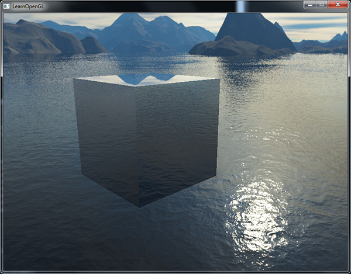

- image from <https://heinleinsgame.tistory.com/29>

- IBL-Reflection
  - IBL(Image Based Lighting)
  - Reflection: 반사

구형 반사체를 큐브맵 안에 위치시키고, 반사체에서 반사되어 큐브맵에 맏닿은 정보를 저장한다.

V  : 월드 뷰 방향
N  : 월드 오브젝트의 표면 Normal
VR : 월드 뷰 방향의 반사 방향

``` ref
texCUBElod  - LOD는 (level of detail)를 의미.

texel = texCUBElod(cubeMap, VR.xyzw);

xyz : direction
w   : detail(max: 1)
```

- [nvidia: texCUBElod](https://developer.download.nvidia.com/cg/texCUBElod.html)

## 53. Image Based Reflection - code 1

``` shader
float3 IBL_Reflection(
    samplerCUBE cubeMap,
    half        detail,
    float3      reflect,
    float       exeposure,
    float       factor)
{
    float4 c = texCUBElod(cubeMap, float4(reflect, detail));
    return factor * c.rgb * (c.a * exeposure);
}
```

## 54. Image Based Reflection - code 2

## 55. Image Based Refraction - intro1

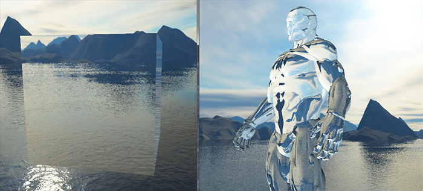

- IBL-Refraction
  - IBL(Image Based Lighting)
  - Refraction: 굴절

## 56. Image Based Refraction - intro 2

유리나 물은 반사와 굴절 모두를 갖는데...


- Snell's law 공식 유도 설명.
- Willebrord Snellius
- [nvidia: refract](https://developer.download.nvidia.com/cg/refract.html)

``` shader
float3 refract(float3 i, float3 n, float eta)
{
  float cosi = dot(-i, n);
  float cost2 = 1.0f - eta * eta * (1.0f - cosi * cosi);
  float3 t = eta * i + ((eta * cosi - sqrt(abs(cost2))) * n);
  return t * (float3)(cost2 > 0);
}
```

## 57. Image Based Refraction - code

``` shader
매질에 대한 반사
float3 world_reflect_V = reflect(-world_V, world_N);

매질에 대한 굴절
float3 world_refract_V = refract(-world_V, world_N, 1 / _RefractiveIndex);
```

## 58. Image Based Fresnel - intro

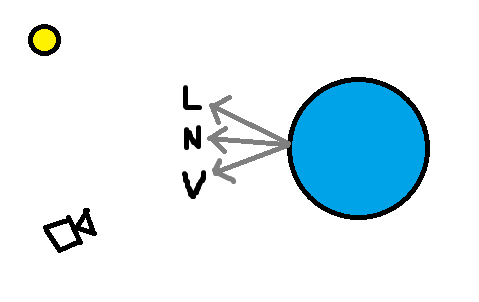

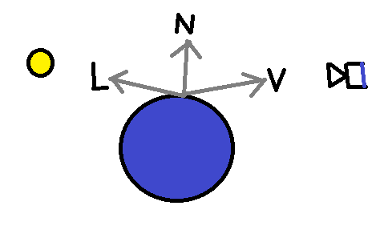

``` shader
H    = normalize( V + L )
spec = pow(saturate(dot(H, N)), power);
```

Blinn-phong에서는 다음과 같은 그림에서 Half-vector를 이용하기에 반사되는 크기가 계산상 같게 나올것이다. 하지만, 현실에서는 L과 V의 각도가 커지면 반사되어 밝게 빛나는 경우가 있다.


Fresnel로 림라이트효과와 반사광효과를 흉내낼 수있다.

굴절률이 n1인 매질에서 n2인 매질로 빛이 투과할 때 반사와 굴절이 일어난다. 프레넬 방정식은 이 성질을 반사계수, 투과계수로 나누어 성분을 분석하여 표현한 방정식이다

- [[ PBR 이란 무엇인가 ] 17. Fresnel 이란?](https://lifeisforu.tistory.com/384)

- [CgTutorial: ch7.4](https://developer.download.nvidia.com/CgTutorial/cg_tutorial_chapter07.html)

### [GPUGems3: ch14](https://developer.nvidia.com/gpugems/GPUGems3/gpugems3_ch14.html)

- [wiki: Schlick's approximation](https://en.wikipedia.org/wiki/Schlick%27s_approximation)

``` shader
// H  is the standard half-angle vector.
// F0 is reflectance at normal incidence (for skin use 0.028).
float fresnelReflectance( float3 H, float3 V, float F0 )
{
  float base = 1.0 - dot( V, H );
  float exponential = pow( base, 5.0 );
  return exponential + F0 * ( 1.0 - exponential );
}
```

## 59. Image Based Fresnel - code 1

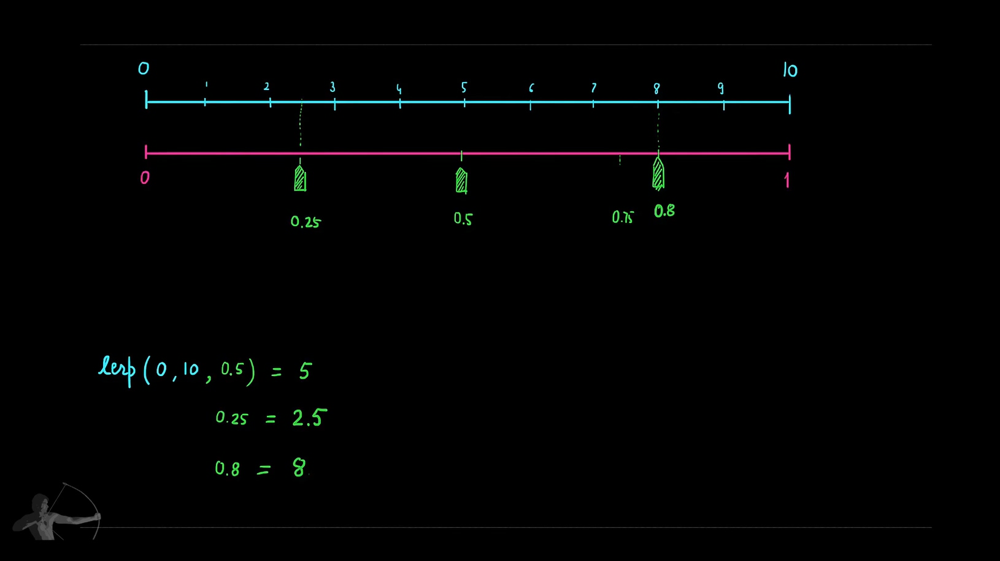

- [nvidia: lerp](https://developer.download.nvidia.com/cg/lerp.html)

``` shader
float fresnel = 1 - saturate(dot(world_V, world_N));
      fresnel = smoothstep(1 - _FresnelWidth, 1, fresnel);
finalColor.rgb = lerp(finalColor.rgb, finalColor.rgb * reflColor, fresnel);
```

## 60. Image Based Fresnel - code 2

## 61. Coordinate Spaces

## 62. Transforming Coordinate Spaces

``` ref
NDC(Normalized Device Coordinate) [-1, 1]
-1,  1                1,  1
  +--------------------+
  |                    |
  |                    |
  |       0,0          |
  |                    |
  |                    |
  +--------------------+
-1, -1                1, -1


Texture Coord [0, 1]
D3D
(0,0)        (1,0)
  +-----+-----+
  |     |     |
  |     |     |
  +-----+-----+
  |     |     |
  |     |     |
  +-----+-----+
(0,1)        (1,1)


OpenGL

(0,1)        (1,1)
  +-----+-----+
  |     |     |
  |     |     |
  +-----+-----+
  |     |     |
  |     |     |
  +-----+-----+
(0,0)        (1,0)

[-1, 1] => [0, 1] = (NDC + 1) / 2

NDC.x = proj_X / proj_W = x / w
U = (x / w + 1) * 0.5
  = (x + w) / w * 0.5
  = (1 / w) * (x + w)  * 0.5
V = (1 / w) * (y + w)  * 0.5
```


_ProjectionParams.x : -1 TopLeft    D3D
                       1 BottomLeft Opengl

UNITY_HALF_TEXEL_OFFSET
-ScreenParams.zw

``` shader
inline float4 ProjectionToTextureSpace(float4 pos)
{
    float4 textureSpacePos = pos;
    #if defined(UNITY_HALF_TEXEL_OFFSET)
        textureSpacePos.xy = float2 (textureSpacePos.x, textureSpacePos.y * _ProjectionParams.x) + textureSpacePos.w * _ScreenParams.zw;
    #else
        textureSpacePos.xy = float2 (textureSpacePos.x, textureSpacePos.y * _ProjectionParams.x) + textureSpacePos.w;
    #endif
    textureSpacePos.xy = float2 (textureSpacePos.x/textureSpacePos.w, textureSpacePos.y/textureSpacePos.w) * 0.5f;
    return textureSpacePos;
}
```

## 63. Shadow Mapping - intro

Tag {"LightMode" = "ShadowCaster"} => _ShadowMapTexture

## 64. Shadow Mapping - code

## 65. Shadow Mapping - Glsl Compatible

``` shader
#pragma multi_compile_fwdbase

#if _SHADOWMODE_ON
    #if defined(SHADER_API_D3D11) || defined(SHADER_API_D3D11_9X) || defined(UNITY_COMPILER_HLSLCC)
        Texture2D _ShadowMapTexture;
        SamplerComparisonState sampler_ShadowMapTexture;
    #elif defined(SHADER_TARGET_GLSL)
        sampler2DShadow _ShadowMapTexture;
    #else
        sampler2D _ShadowMapTexture;
    #endif
#endif

#if _SHADOWMODE_ON
    // 에디터는 cascading shadows를 사용. 모바일 플렛폼은 사용하지 않음.
    #if defined(UNITY_NO_SCREENSPACE_SHADOWS)
        o.shadowCoord = mul(unity_WorldToShadow[0], o.posWorld);
    #else
        o.shadowCoord = ProjectionToTextureSpace(o.pos);
    #endif
#endif

#if _SHADOWMODE_ON
    #if defined(SHADER_TARGET_GLSL)
        float shadow =  shadow2D(_ShadowMapTexture, i.shadowCoord);
    #else
        // Factor in shadow strength using _LightShadowData.r
        #if defined(SHADER_API_D3D11) || defined(SHADER_API_D3D11_9X) || defined(UNITY_COMPILER_HLSLCC)
            float shadow = (_ShadowMapTexture.SampleCmpLevelZero (sampler_ShadowMapTexture, i.shadowCoord.xy, i.shadowCoord.z)? 1.0 : _LightShadowData.r);
        #elif defined(UNITY_NO_SCREENSPACE_SHADOWS)
            float shadow = ((tex2D(_ShadowMapTexture, i.shadowCoord.xy).r < i.shadowCoord.z) ? 1.0 : _LightShadowData.r);
        #else
            float shadow = tex2D(_ShadowMapTexture, i.shadowCoord).a;
        #endif
    #endif
#endif
```

## 66. BRDF - intro

``` ref
BRDF 는 "Bidirectional Reflectance Distribution Function" 의 머리글자입니다.
우리 말로는 "양방향 반사율 분포 함수"입니다.
이 BRDF 는 Diffuse BRDF 와 Specular BRDF 로 나뉩니다.

출처: https://lifeisforu.tistory.com/386 [그냥 그런 블로그]
```

BRDF - ex) 뷰 방향과 라이트 방향으로부터, 불투명한 표면에 반사되는 방식을 구함.

``` ref
특정방향(눈 혹은 카메라              )으로     반사된 빛의 양
-------------------------------------------------------------
특정방향(특정포인터로부터의 빛의 방향)으로부터 도달한 빛의 양
    Radiance
= -------------
    Irradiance


BRDF
    반사된 빛의 양
= --------------------
    Li * 면적 x Cos

  등방성(  isotropic): 반사도가 표면이 향하는 방향이나 회전에 의해 변하지 않음.
비등방성(anisotropic): 반사도가 표면이 향하는 방향이나 회전에 의해 변함.
```

Microfacet Theory


|            |      |                                    |
| ---------- | ---- | ---------------------------------- |
| Radiance   | 복사휘도 | 빛의 표면의 단위면적당 방출된 에너지(단위 시간당 특정 방향) |
| Irradiance | 복사조도 | 받은 에너지(단위 면적)                      |

## 67. BRDF - Spherical Coordinate System

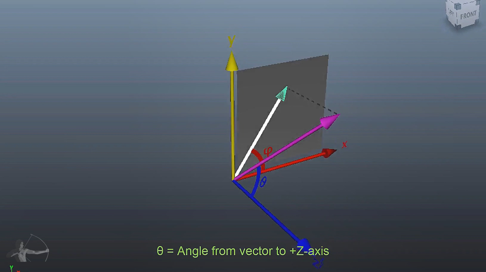

구면좌표 : $[r, \theta, \varphi]$

$\theta$ : z축으로부터 각도
$\varphi$: yx평면으로 투영된 벡터로부터 +x축으로의 각도

상반성 reciprocity

## 68. BRDF - Anisotropy - intro

- Ashikhimin-Shirley && Ashikhimin-Premoze
  - Ashikhimin-Shirley제안 Ashikhimin-Premoze에 의해 수정

``` ref
H = Halfway
T = Tangent
B = Bitangent
```

${\sqrt{(n_u+1) + (n_v+1)} (N \cdotp H)^{ N_u(H \cdot T) + n_v(H \cdot B)^2 \over 1 -(N \cdot H)^2} \over 8_\pi \cdot (V \cdotp H) \cdot max((N \cdotp L), (N \cdotp V)) } \cdot FrennelTerm$

$F = (reflect + (1 - reflect) \cdot (1 - (V . H))^5)$

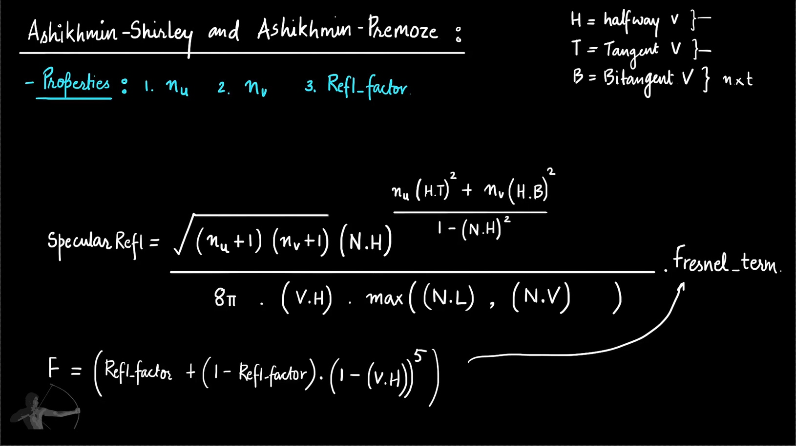

## 69. BRDF - Anisotropy - code 1

## 70. BRDF - Anisotropy - code 2

``` shader
float AshikhminShirleyPremoze_BRDF(float nU, float nV, float3 tangentDir, float3 normalDir, float3 lightDir, float3 viewDir, float reflectionFactor)
{
    float pi = 3.141592;
    float3 halfwayVector = normalize(lightDir + viewDir);
    float3 NdotH = dot(normalDir, halfwayVector);
    float3 NdotL = dot(normalDir, lightDir);
    float3 NdotV = dot(normalDir, viewDir);
    float3 HdotT = dot(halfwayVector, tangentDir);
    float3 HdotB = dot(halfwayVector, cross(tangentDir, normalDir));
    float3 VdotH = dot(viewDir, halfwayVector);

    float power = nU * pow(HdotT,2) + nV * pow(HdotB,2);
    power /= 1.0 - pow(NdotH,2);

    float spec = sqrt((nU + 1) * (nV + 1)) * pow(NdotH, power);
    spec /= 8.0 * pi * VdotH * max(NdotL, NdotV);

    float Fresnel = reflectionFactor + (1.0 - reflectionFactor) * pow(1.0 - VdotH, 5.0);
    spec *= Fresnel;
    return spec;
}

float4 tangentMap = tex2D(_TangentMap, o.texcoord.xy);
float3 specular = AshikhminShirleyPremoze_BRDF(_AnisoU, _AnisoV, tangentMap.xyz, o.normal, lightDir, worldViewDir, _ReflectionFactor);
```

## 71. Profiling Shaders using Xcode

Xcode 디버그
=> 카메라버튼
=> RenderCommandEncoder 더블클릭