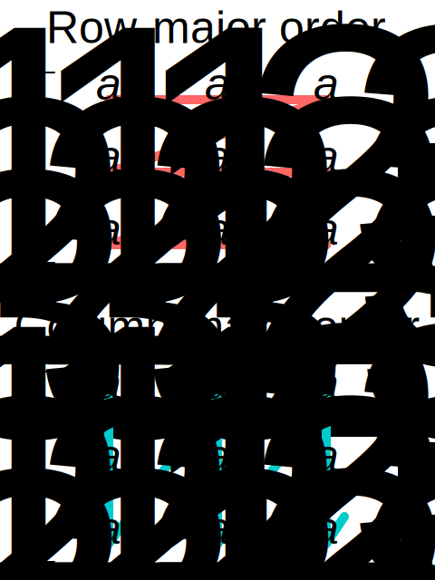

# 기타

## 오른손 / 왼손 좌표계

``` ref
손가락 맨날 햇갈림 이케 외우자.
X : 엄지(엄지는 항상 오른쪽방향으로)
Y : 검지(검지는 항상 위쪽)
Z : 중지

X x Z = Y : 오른손 좌표계 - OpenGL(since 1992) '오'픈 지엘이니(or 먼저나왔으니) 오른쪽.
  /Z
 /
+---- X
|
|
Y

  Y
  |
  |
  +---- X
 /
/
Z

X x Z = Y : 왼손 좌표계 - DirectX(since 1995) 나중에 나왔으니 왼쪽.

Y
| /Z
|/
+---- X
```

## Column Major vs Row Major




``` ref

N x 1 matrix : column vector
1 x N matrix : row vector

그러나 D3DX 는 row-major 행렬을 사용하고 OpenGL은 column-major

https://docs.microsoft.com/en-us/windows/win32/dxmath/pg-xnamath-getting-started?redirectedfrom=MSDN#matrix_convention
Direct3D has historically used left-handed coordinate system, row-major matrices, row vectors

HLSL shaders default to consuming column-major matrices


https://docs.microsoft.com/en-us/windows/win32/direct3dhlsl/dx-graphics-hlsl-per-component-math
Matrix packing order for uniform parameters is set to column-major by default
 #pragmapack_matrix directive, or with the row_major or the column_major keyword.

Row-Major
mul(v, TranslateMatrix) = float4
            | 1 0 0 0 |
| 1 2 3 1 | | 0 1 0 0 | = | (1 + 5) 2 3 1 |
            | 0 0 1 0 |
            | 5 0 0 1 |


Colum-Major
mul(v, TranslateMatrix) = float4

            | 1 0 0 5 |
| 1 2 3 1 | | 0 1 0 0 | = | 1 2 3 (5 + 1) |
            | 0 0 1 0 |
            | 0 0 0 1 |

mul(TranslateMatrix, v) = float4

| 1 0 0 5 | | 1 |   | 1 + 5 |
| 0 1 0 0 | | 2 | = | 2     |
| 0 0 1 0 | | 3 |   | 3     |
| 0 0 0 1 | | 1 |   | 1     |


동일한 float4이라도 곱하는 순서에 따라 값이 다르다.
```

## DXT

``` ref  
노멀맵 같은 경우에는 red채널의 변화가 심하기 때문에,
R채널을 A채널로 바꾸고 DXT5로 저장한 후,
shader에서 AGB로 접근하여 샘플링하면 상당히 괜찮은 결과를 얻어낼 수 있습니다.
- https://gpgstudy.com/forum/viewtopic.php?t=24598
```

### DXT5nm 포맷을 이용(퀄리티 업)

| V   | color | channel       | bit |
| --- | ----- | ------------- | --- |
| X   | R     | a0, a1        | 16  |
|     |       | alpha indices | 48  |
| Y   | G     | color0,1      | 32  |
|     |       | color indices | 32  |
| Z   | B     | x             | 0   |

- xyzw, wy => _g_r => rg => xyn // r이 뒤로 있으므로, 한바퀴 돌려줘야함.
- `normal.xy = packednormal.wy * 2 - 1;` (0 ~ 1 => -1 ~ 1)
- `Z`는 쉐이더에서 계산. 단위 벡터의 크기는 1인것을 이용.(sqrt(x^2 + y^2 + z^2) = 1)

#### DXT1, (RGB 5:6:5), (RGBA 5:5:5:1)

|               |                  |
| ------------- | ---------------- |
| color0        | 16               |
| color1        | 16               |
| color indices | `4 * 4 * 2 = 32` |

``` ref
    (RGB)24 * 16 = 384
    384 / 64 = 6
    6배를 아낄 수 있다.
```

#### DXT3

|               |                  |
| ------------- | ---------------- |
| alpha         | 64               |
| color0        | 16               |
| color1        | 16               |
| color indices | `4 * 4 * 2 = 32` |

``` ref
    (RGBA)32 * 16 = 512
    512 / 128 = 4
    4배를 아낄 수 있다.
```

#### DXT5

|               |                  |
| ------------- | ---------------- |
| a0            | 8                |
| a1            | 8                |
| alpha indices | 48               |
| color0        | 16               |
| color1        | 16               |
| color indices | `4 * 4 * 2 = 32` |

``` ref
    R4G4B4A4
    R4G4B4A4 (출력시 보간 A8)
```

- [DXT5nm](https://github.com/castano/nvidia-texture-tools/wiki/NormalMapCompression)
- [Normalmap compression](https://mgun.tistory.com/1892)
- [Texture types](http://wiki.polycount.com/wiki/Texture_types)
- <https://www.nvidia.com/object/real-time-normal-map-dxt-compression.html>
- [bc5](https://docs.microsoft.com/en-us/windows/desktop/direct3d10/d3d10-graphics-programming-guide-resources-block-compression#bc5)

## 외곽선

- [gpg:쉐이더 없이 카툰 외곽라인 처리시 질문입니다](https://gpgstudy.com/forum/viewtopic.php?p=94423#94423)
- [[GPG 2 글 5.1] 외곽선 렌더링 방법에 대해](https://gpgstudy.com/forum/viewtopic.php?t=18157)

``` ref
글쓴이: 그레이오거 » 2007-12-12 10:54

외곽선 처리 방식을 크게 나누면,

1. 버텍스와 노멀을 가지고 노는거(VS)
2. 일단 렌더링 건다음 이미지 프로세싱으로 외곽선을 따주는거(PS)
3. 따로 선만 그려주는거

거의 요 세가지에 속하더군요.

1번의 경우 비교적 계산비용이 작습니다. 라이트벡터와의 내적을 이용한 방식은 속도 지존입니다만 로우폴리곤이나 디자이너가 와이어프레임 감각이 없는 경우 안하느니만 못한 퀄리티가 나오기 때문에 사용이 좀 한정적입니다. 외곽선에 폴리곤으로 라인을 생성해 주는 방식도 있습니다. 가장 흔한게 노말 뒤집어 확대해 찍어주는거죠. GPU의 적 2Pass이긴 하지만 개인적으로는 가격대 퀄리티면에서 가장 좋다고 봅니다. 걍 선 자체도 폴리곤이다 보니 거리에 따라 자동으로 외곽선 두께가 비례에 맞게 조절됩니다. 특히 이건 만약 프로그래머가 쉐이더를 몰라도 맥스에서 만들어 줄 수도 있습니다. 다만 위엣분들이 말슴하셨듯, 중복 노멀을 가지고 있을 경우 별도처리를 해야 하는 귀찮음이 있습니다.

2번의 경우 외곽선 두께가 균일하고 퀄리티 면에서도 가장 좋습니다. 깊이감이 있는 외곽선 묘사도 가능하고요(얼굴 외곽라인을 묘사할때 턱선은 서서히 옅어지게도 할 수 있습니다. gooch shading과 함께 쓰니 캐릭터 얼굴 진짜 이쁘게 나오더라고요! >o<b), 깊이, 컬러, 노말값 등등 중에서 어느걸 기준으로 하느냐에 따라 달라지지만 기본적으로 이미지 프로세싱을 쓰다보니 다채로운 효과가 가능합니다. 노멀문제, 알파문제, 스키닝도 자동해결됩니다. 안티알리어싱도 디폴트로 처리됩니다. 다만 PS에 다중샘플링이 필수인데다, 각각의 방식이 독자적으로는 완전하지 못해 보완적으로 섞어주어야 하기 때문에 퍼포먼스 좀(...사실은 많이) 먹습니다. 그래서 저는 결국 빼버리고 노말뒤집기로 갔습니다(지못미... ㅠ_ㅠ);;

3. 보통 면단위로 노멀을 계산해 경계선으로 판단되는 경우 라인이나 폴리곤 띠를 따로 생성해 그려주는 방식입니다. 1번 방식과 흡사하지만 선 두께가 오브젝트의 크기나 거리에 상관 없이 균일하게 유지됩니다. 아마도 제시하신 스샷에서는 이 방식으로 추측됩니다.

높은 퀄리티보다는 다수의 오브젝트 처리가 중요한 경우 1번을, 소수지만 퀄리티가 중요할 경우 2번을, 적절한 부하와 균일한 선 두께을 원할 경우 3번을 택하는 것 같더군요.

갠적으론 gooch + depth 기반 PS선따기 원츄! ㅡ_ㅡb
```